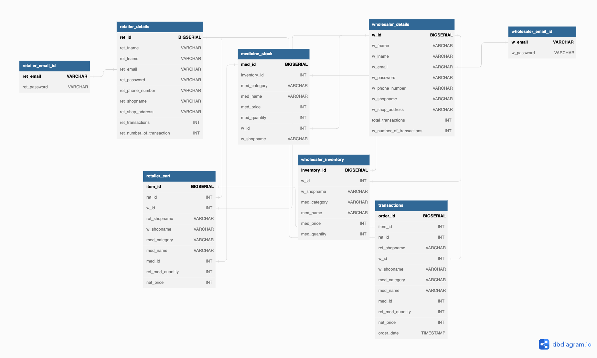
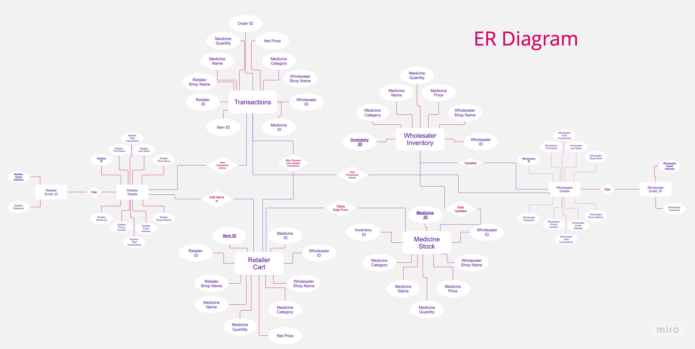

# DBMS Project

This project is a database management system (DBMS) for managing medicine stocks. It's built with React for the frontend and Express.js for the backend, and uses PostgreSQL for the database.

## Project Structure

The project is divided into three main directories:

- `public/`: Contains static files like `index.html`, `manifest.json`, and `robots.txt`.
- `server/`: Contains the server-side code, including the database setup and API endpoints.
- `src/`: Contains the client-side code, including React components and CSS files.

## Database

The database is set up in PostgreSQL. The schema and procedures are defined in the `server/` directory, in `database.sql`, `functions.sql`, `procedure.sql`, and `triggers.sql`.

The database connection is set up in `server/db.js`, using the `pg` library.

## Running the Project

To run the project, you need to start both the server and the client.

### Starting the Server

1. Navigate to the `server/` directory.
2. Run `npm install` to install the necessary dependencies.
3. Run `npm start` to start the server.

### Starting the Client

1. Navigate to the root directory.
2. Run `npm install` to install the necessary dependencies.
3. Run `npm start` to start the client. The client will be available at [http://localhost:3000](http://localhost:3000).

## Database Schema

## ER Diagram

## Contributing

If you'd like to contribute to this project, please fork the repository and make changes as you'd like. Pull requests are warmly welcome.

## License

This project is open-sourced software licensed under the MIT license.